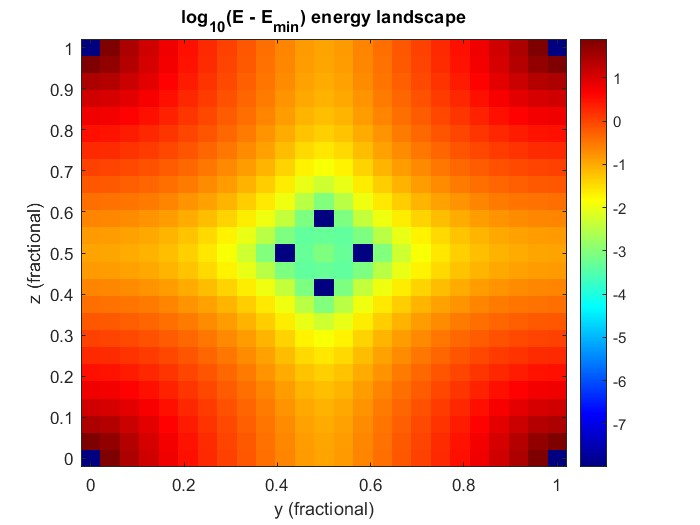

# Hydrogen storage in Ti-Fe-Hf alloys
## Step 1
Bjorn: I performed the convergence tests, I worked on my local cluster provided by the university of antwerp, I tried running it first on my own virtual machine but this took literal hours, so I switched to the hpc.
The convergence tests resulted in the following parameters for the TiFe crystal cif file: k = 11 11 11, ecutwfc = 124 and ecutrho = 1736 (=14 * 124). Running the calculation this way took about 40 seconds on the cluster. The resulting hydrostatic pressure was 31.33 kbar.

## Step 2
Rostislaw: Performed the geometry optimization (static, relaxed and full) of a TiFe crystal.
### Static optimization
The static optimization was performed by varying the lattice parameter $A \in [2.81868 ~\overset{\circ}{A}, 3.03868 ~\overset{\circ}{A}]$ in steps of $\Delta A = 0.01 \overset{\circ}{A}$. This resulted in 25 DFT simulations, from which 4 did not converge (Error in routine electrons (1): charge is wrong). Fitting the unit-cell volume V and the total energy E from these simulation to a Birch-Murnaghan formula yield the following parameters:
- $V_0 = 173.20 ~\text{a.u.}^3 = 25.67 \overset{\circ}{A}^3$
- $B_0 = 177.7 ~\text{GPa} = 1777 ~\text{kbar}$
- $B_1 = 7.45$
- $E_0 = -448.58605 ~\text{Ry}$

")

On the figure, 3 data points can be seen which (significantly) deviate from the Birch-Murnaghan formula (not sure why, maybe some tuning in the input files is needed, or it's just a property of a crystal (TODO: test with other input parameters)).

### Static optimization k = 15
- $V_0 = 173.99 ~\text{a.u.}^3$
- $B_0 = 192.7 ~\text{GPa}$
- $B_1 = 4.20$
- $E_0 = -448.58683 ~\text{Ry}$

 k = 15")


### Relaxed optimization
The relaxed optimization was performed by varying the goal pressure P of a crystal. $P \in [-261.95 ~\text{GPa}, 361.95 ~\text{GPa}]$ in steps of $\Delta P = 41.67 ~\text{GPa}$. Data, once more, was fitted to the Birch-Murnaghan formula, and produced:
- $V_0 = 173.30 ~\text{a.u.}^3$
- $B_0 = 165.5 ~\text{GPa}$
- $B_1 = 8.59$
- $E_0 = -448.58577 ~\text{GPa}$

")

Also here, data (1 point) deviates from the Birch-Murnaghan model. $V_0$ from both methods are almost identical, while $B_0$ and $B_1$ have changed quite a bit. The energy at equilibrium in the case of the relaxed optimization is higher.

### Relaxed optimization k = 15
 k=15")
- $V_0 = 173.99 ~\text{a.u.}^3$
- $B_0 = 192.6 ~\text{GPa}$
- $B_1 = 4.21$
- $E_0 = -448.58683 ~\text{GPa}$


## Full optimization
The full optimization was performed with
- press=0.d0
- press_conv_thr=0.1d0 (0.1 kbar)

The result of this optimization:
- $V_0 = 171.2590 ~\text{a.u.}^3$
- $A = a = 5.5533 ~\text{a.u.}$
- $E_0 = -448.58686914 ~\text{Ry}$
- $P = 0.08 ~\text{kbar}$ (with diagonal stress elements = 0.08)

We see that this optimization provides lower $V_0$ and lower $E_0$ in comparison with previous optimizations.

### $P = 100 ~\text{kbar}$
Performing the same full optimization, but with
- press=100.d0
- press_conv_thr=0.1d0

results in

- $V_0 = 171.2590 ~\text{a.u.}^3$
- $A = a = 5.5533 ~\text{a.u.}$
- $E_0 = -448.58420157 ~\text{Ry}$
- $P = 99.70 ~\text{kbar}$

There is almost no change in the parameters (with exception of $E_0$, which became higher). This is to be expected as the bulk modulus of TiFe is $165.5 ~\text{GPa}$ which is much higher than the applied pressure of $10 ~\text{GPa}$. From the Murnaghan equation, we can estimate that the pressure difference of $10 ~\text{GPa}$ would cause a decrease in volume of $0.060249$%.

## Full optimization k = 15

- press=0.d0
- press_conv_thr=0.1d0 (0.1 kbar)

The result of this optimization:
- $V_0 = 171.2590 ~\text{a.u.}^3$
- $A = a = 5.5533 ~\text{a.u.}$
- $E_0 = -448.58682953 ~\text{Ry}$
- $P = 0.09 ~\text{kbar}$ (with diagonal stress elements = 0.08)

### $P = 100 ~\text{kbar}$

- press=100.d0
- press_conv_thr=0.1d0

results in

- $V_0 = 171.2590 ~\text{a.u.}^3$
- $A = a = 5.5533 ~\text{a.u.}$
- $E_0 =  -448.58415002 ~\text{Ry}$
- $P = 99.75 ~\text{kbar}$

Estimated pressure change from the Murnaghan equation: decrease of $0.052$%.

## Step 3

Bjorn: I ran a full geometry optimization for the following crystal structures: TiFe, TiFe2 (kubic), Tife2 (hexagonal), HfFe, HfFe2 (kubic), HfFe2 (hexagonal), Fe and Ni. 

For the Fe, Ni, TiFe, TiFe2 (hexagonal), HfFe2 (cubic) and HfFe2 (hexagonal) structures cif files were available on the material project website, here was also listed wheter these materials had magnetic properties or not. Fe and Ni are ferromagnetic, while all the other structures that had magnetism were ferrimagnetic. From these cif files, geometric optimization was easily performed by contructing a appropriate input file for a vc-relax calculation. The initial magnetic moment for each atom type and site was taken from the material project page, better values were found for our pseudopotential and setup during the relaxation calculation. 

An important remark for doing these calulations concerns the choice of the specific values for the calculation parameters we found in the first step. The values for ecutrho and ecutwfc could remain the same but the value for the k mesh changes for each unit cell. This value for k was optimized for the TiFe unit cell with cell parameter A = 2.93868, all other unit cells (not the pure matelic ones) have a bigger unit cell. When we increase the unit cell the first brillouin zone decreases so less k points are needed to achieve the same sampling in k space, the new k value in a certain direction then becomes: k' = round((k*A)/A') (e.g. increasing A by a factor 2 will decrease k by a factor of 2). This step is necessary for the calculation with the bigger unit cells otherwise the calculations are way too heavy.

For the other structures no cif file is available on the material project website, but they can be reconstructed from the cif files from the other sturctures with the same symmetry and atomic positions. So we can just replace the type of atoms at certain atomic cites to get the input files for the new crystal. However then the cell parameter is completely wrong and we have no idea if this cell has magnetic properties. In order to get this information, we first perform a vc-relax calculation without any magnetism defined, this will get us a good first estimate of the cell parameter. With this new pareter we can run two scf calculation, one without magentism and one with mangetism (for which we can get a relativly good first estimate of the magnetic moments from the corresponding crystall structure that is on the material project page) we compare these outputs and if the magnetic scf caclulation converges to a net  magnetic moment and the energy is comparable to that of the non-magnetic scf caclulation we can conclude that this stucture has nog magnetic properties. This was the case for the HfFe structure. If the magnetic calculation does converge to a total magnetic moment, we can conclude that this sturctue does have magnetic properties. In both cases we then perform a full vc-relax calculation now with the correct magnetic properties defined, using the outputted magnetic moments as a new initial guess of the magnetic vc-relax calulation. 

Doing the procedure for the stuctures listed above resulted in the following final parameters:

| Compound        | Lattice parameter A (Å) | Magnetic character | starting_magnetization values (μ<sub>B</sub>) |
|-----------------|--------------------------|--------------------|-----------------------------------------------|
| **Fe**          | 2.833763778              | Ferromagnetic      | (1) = 2.2266                                 |
| **Ni**          | 3.51698829               | Ferromagnetic      | (1) = 0.6956                                 |
| **TiFe**        | 2.954090826              | Non-magnetic       | —                                             |
| **TiFe₂ (cubic)** | 6.755434149            | Ferrimagnetic      | (1) = 1.7786 (Fe); (2) = –0.5591 (Ti)        |
| **TiFe₂ (hexagonal)** | 4.775040937        | Ferrimagnetic      | (1) = 1.5362 (Fe₂); (2) = 1.7093 (Fe₆); (3) = –0.5036 (Ti) |
| **HfFe**        | 3.14111794               | Non-magnetic       | —                                             |
| **HfFe₂ (cubic)** | 6.995744408            | Ferrimagnetic      | (1) = 1.9377 (Fe); (2) = –0.3193 (Hf)        |
| **HfFe₂ (hexagonal)** | 4.950603678        | Ferrimagnetic      | (1) = 1.8320 (Fe₂); (2) = 1.8586 (Fe₆); (3) = –0.3349 (Hf) |
| **TiNi**          | 3.0097930252             | Non-magnetic       | —                                            |
| **TiNi₂ (cubic)**          | 6.7114000001             | Non-magnetic       | —                                            |
| **TiNi₂ (hexagonal)**         | 4.7481984977             | Non-magnetic       | —                                            |


From the available phase diagrams on Materials Project, we can conclude that the following structures are stable:
- TiFe
- TiFe₂ (cubic)
- HfFe₂ (cubic)

## Step 4
Bjorn: In this step we inserted H atoms into high symmetry positions inside the TiFe basis crystal structure and calculated the formation energy (rescaled per inserted H atom) to see which final structure would occur spontaneously. Details about which positions where tested can be found in the corresponding excel file. It is also imported to not forget the increase of the volume of the unit cell, for certain high symmetry positions multiple H atoms could be insterted per formula unit of TiFe, which resulted in a lower total energy and someetimes a lower energy per H atom, but this came at a cost of a hugely increased volume, which is of course also not desirable in the contect of solid state H batteries. 

The main conclusion is that the H atom prefers to occupie a position on the face of the original unit cell ((1/2, 1/2, 0) = 3c position) we therefore found it to be insightfull to also study the energy landscape of the face of the unit cell. For this a grid search type calculation was perfromed that did a scf caclulations where the H atom was put at different positions of a grid on the face of the original unit cell. (to keep the calculation time manageble a grid of 25x25 was chosen) the result was: 



Interestingly we notice that the energy minima is NOT the (0.5, 0.5, 0) position but there are rather 4 local minima symmetrically around the center, since this made not much sense i did some investigating, from what i can tell this is correct, however it is a result of the static scf caclulation. If the volume is fixed and the H atom is placed in the center the H atom is set in a local maxima of the energy, which is why we dont see it move if we do a relax calculation with H starting at (0.5,0.5,0): 

"relax" calculation: TiFeH (0, 0.5, 0.5) -> (0, 0.5, 0.5) E = -449.7118933 Ry

If we do a "relax" caclualtion with the the H atom placed at minima position we found with the grid search (which is (0.5, 0.416667, 0)) the atom indeed stays at that position (withing the resolution of the original grid): 

"relax" calculation: TiFeH (0, 0.416667, 0.5) -> (0.5, 0.40251, 0.5) E = -449.71406946 Ry (the Fe atoms also moves up to (0.5, 0.52029, 0.5) and the Ti atom moves down slightly to (0.0, -0.0061, 0.0)

So indeed this is a local minima in the energy. However when we now do a "vc-relac" calculation with the H atom starting in this positions we get the following change of positions: 


"vc-remax" calculation: TiFeH (0, 0.416667, 0.5) ->
```text
Fe               0.5000000000        0.4722267123        0.5000000000
Ti               0.0000000000       -0.0277794717        0.0000000000
H                0.0000000000        0.4722194261        0.5000000000
```
E = -449.75333069 Ry


Which indeed is again a final position at (0, 0.5, 0.5) if we redefine the origin of the y-axis, pfew, ineed the local minima we found were artefacts of the fact that we constrained the volume. This is however still of note! 


